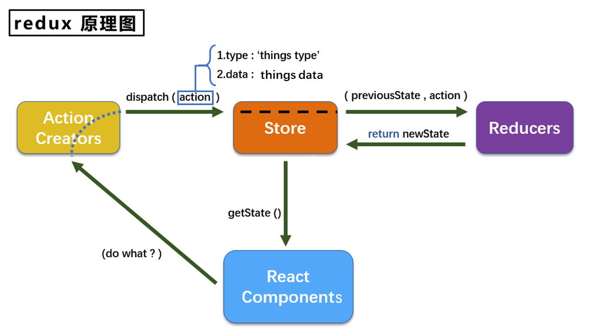

# Redux 集中式状态管理

我们对一般组件中的状态的管理基本上都是通过state来实现的。比如，我们在给兄弟组件传递数据的时候，需要先将数据传递给父组件，再由父组件转发给它的子组件。这个过程十分复杂。也可以使用消息的发布订阅，通过pubsub库，实现了消息转发，直接将数据发布。由兄弟组件订阅。实现了兄弟组件间的数据传递。

但是，我们在实际开发过程中要进行更加复杂的数据传递，更多层的数据交换。因此我们为何不可以将所有的数据交给一个中转站，这个中转站独立于所有的组件之外，由这个中转站来进行数据的分发，这样不管哪个组件需要数据，我们都可以很轻易的给他派发。

而有这么一个库就可以帮助我们实现数据的中转，那就是Redux，它可以帮助我们实现集中式状态管理

## <p><p>

## 一、什么情况使用Redux
Redux适用于多交互、多数据源的场景。简单理解就是复杂环境。

从组件角度去思考的话，我们有以下的应用场景时候，可以尝试采用 Redux 来实现

1.某个组件的状态需要共享时 

2.一个组件需要改变其他组件的状态时

3.一个组件需要改变全局的状态

除此之外，还有很多情况都需要使用Redux来实现

## 二、Redux的工作原理


首先组件会在Redux中派发一个`action`方法，通过调用`store.dispath`方法，将`action`对象派发给`store`，当`store`接收到`action`对象时，会将先前的`state`与传来的`action`一同发给`reducer`，`reducer`在接收到数据后，进行数据的更改，返回一个新的状态给`store`，最后由`store`更改`state`

## 三、Redux三个核心概念

### 1.store

`store`是Redux的核心，可以理解为是Redux的数据中台，我们可以将任何我们想要存放的数据都放在`store`中，在我们需要使用这些数据时，我们可以从中取出相约的数据。因此我们需要先创建一个`store`，在Redux中可以使用`createStore`API来创建一个`store`

在生产中，我们需要在`src`目录下的`redux`文件中新增一个`store.js`文件，在这个文件中，创建一个`store`对象，并暴露它

因此我们需要从redux中暴露两个方法 `createStore`,`applyMiddleware`用于创建`store`和配合`thunk`来处理异步管理数据使用。

```
    import { createStore, applyMiddleware } from 'redux'
    import thunk from 'redux-thunk

```
并引入为count组件服务的reducer
```
    import countReducer from './countReducer.js'
```
最后调用`createStore`方法来暴露`store`
```
    export default createStore(countReducer,applyMiddleware(thunk))
``` 

在 `store`对象下有一些常用的内置方法

获取当前时刻的store，我们可以采用getStore方法
```
    const store = store.getStore()
```
在前面我们的流程图中，我们需要通过`store`中的`dispatch`方法来派生一个`action`对象给store
```
    store.dispatch(`action对象`)
    例：store.dispatch({type:'xx',data:'xx'})
```
最后还有一个subscribe方法，这个方法可以帮组我们订阅`store`的改变，只要`store`发生改变，这个方法的回调就会执行。

为了监听数据的更新，我们可以将subscribe方法绑定在组件挂载完毕生命周期函数上，但是这样，当我们的组件数量很多时，会比较麻烦，所以我们可以直接将subscribe函数用来监听整个`App`组件的变化
```
    store.subscribe(()=>{
        ReactDOM.render(<App /> , documnent.getElementById('root'))
    })
```

### 2.action
`action`是`store`中唯一的数据来源，一般来说，我们会通过调用`store.dispatch`将 action 传到 store

我们需要传递的`action`是一个对象，它必须有一个type值
```
    export const createIncrementAciton = data => ({
        type:INCREMENT,
        data
    })
```
我们调用它时，会返回一个`action`对象

### 3.reducer

在Reducer中，我们需要指定状态的操作类型，要做怎么样的数据更新，因此这个类型是必要的。

reducer会根据action的指示，对state进行对应的操作，然后返回操作后的state

如下，我们对接受的action中传来的type进行判断
```
    export defaule function countReducer(preState = 0 , action){
        const { type , data } = action;
        switch( type ){
            case INCREMENT :
                return preState + data * 1
            case DECREMENT :
                return preState - data * 1
            default:
                return preState
        }
    }
```
更改数据，返回新的状态

## 四、创建 constant 文件

在我们正常的编码中，有可能会出现拼写错误的情况，但是我们会发现，拼写错误了不一定会报错，因此就会比较难排查。

我们可以在`redux`目录下，创建一个 `constant`文件，这个文件用于定义我们代码中常用的一些变量。

```
    export const INCREMENT = 'increment'
    export const DECREment = 'decrement
```
将这两个单词写在`constant`文件中，并对外暴露，当我们需要使用时候，就可以引入文件，并直接使用它们的名称即可

## 五、实现异步action

一开始，我们直接调用一个异步函数，这虽然没什么问题，但是我们想要在rendux中去实现异步方法

我们可以先尝试将它封装到`action`对象中调用

```
    export const createIncrementAsyncAction = (data,time) => {
        return (dispatch) => {
            seTimeout(() => {
                dispatch(createIncrementAction(data)
            })
        }
    }
```

当我们点击异步操作时候，会调用这个函数，在这个函数汇总接收一个仿造异步的函数，这个函数接收一个action的数据和延时时间。在这个函数中在去`dispatch`调用同步的`action`

但是如果仅仅这样，很明显会报错的，因为`action`默认需要接收一个对象。

如果我们需要实现传入函数，那我们需要告诉`store`：你需要帮我执行下这个函数就好

这时候我们就需要引入中间件，在原生的`redux`中暴露出`applyMiddleware`中间件执行函数，并引入`redux-thunk`中间件(上文也有所表示)

```
    import thunk from 'redux-thunk'
```

通过第二个参数传递下去就可以

```
    export default createStore(countReducer,applyMiddleware(thunk))
```

注意：异步action不是必须要写的，完全可以等自己异步任务获取到结果后在同步分发给action

## 六、Redux三大原则

理解好redux有助于我们更好理解react-redux

### 第一个原则
单项数据流： 整个redux中，数据流都是单向的

UI组件 --> action --> store --> reducer --> store

### 第二个原则

store只读：在Redux中不能通过直接改变state，来控制状态的改变，如果你想改变state，则需要触发一个action。通过action执行reducer

### 第三个原则

纯函数执行：每一个reducer都是纯函数，不会有任何的副作用，返回是一个新的state，state改变会触发store中的subscribe


